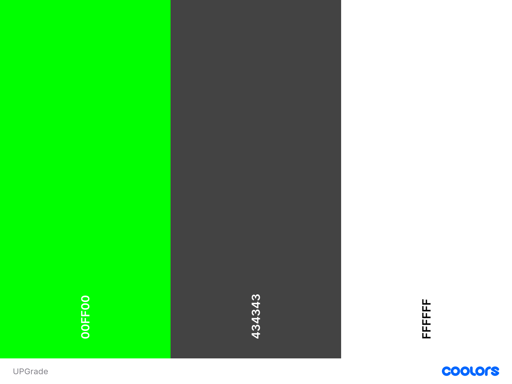

# **UPGrade**

#### UPGrade is a grading system which handles SQL data from different tables to store student information, such as courses and grades. Users can create new students and courses, and be able to enroll students in courses. Courses have their own assignments which can be created and each have a grade from 0-100. The system is able to take the average of the assignments for a student's grade for an entire course.

  COLOR PALETTE            |  DEMO
:-------------------------:|:-------------------------:
   |  <video width=100% controls><source src="UPGradedemo\UPGrade-demo.mp4" type="video/mp4">DEMO Video</video>

## **KEY FEATURES:**
Student Management
Easily view and manage student profiles, track individual progress, and access essential data such as grades, attendance, and academic performance.
Course Overview

View detailed information about courses, including course structure, syllabus, and schedule.
Monitor enrollment and progress for each course, ensuring seamless course management.
Student Enrollment

Effortlessly add students to courses, ensuring accurate and up-to-date rosters.
Streamline the registration process to ensure smooth integration into the appropriate courses.
Course Creation & Management

Teachers and administrators can create new courses with customizable details, such as course content, timelines, and prerequisites.
Manage course structure and delivery in a user-friendly interface.
Assignment Management

Easily create, assign, and track assignments within the platform.
Students can submit assignments, and instructors can grade and provide feedback directly in the system, ensuring efficient assignment handling.

## **HOW TO USE (intellij idea)**
1. input a number 1-8 after reading choices 
2. one allows you to view all students
3. two allows you to view course names
4. Three allows you to view the details of a course
5. Four  adds courses
6. Five adds assignments to courses
7. Six allows you to enroll students in to courses
8. Seven allows you to add a student to the database
9. Eight allows you to input students grads
10. Nine allows you to leave the program

                                 